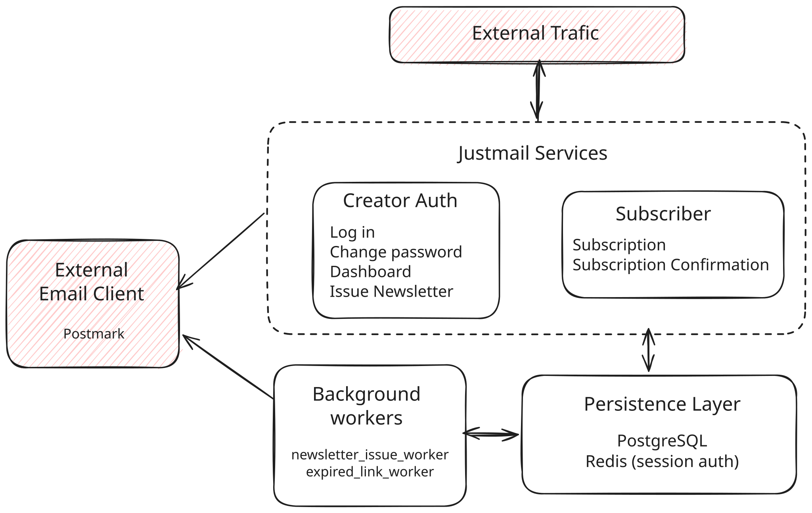

# Justmail

---

## 📌 Overview

Justmail is a production-ready newsletter API build in Rust. It enables creators
to safely capture subscriptions via double opt-in email confirmation and
securely broadcast newsletters using authenticated endpoints.

The current version focuses strictly on core delivery services. It does not
support multiple user registration (I am the only admin) or unsubscriptions
(that's why it's called justmail LOL).

---

## 🏗️ Architecture



### 1. External Traffic ↔ Justmail Services

Communication occurs via **HTTPS REST calls**.

#### Creator Authentication & Operations

- **`login`**
  - **Flow:** Verifies credentials via `argon2` password hashing in PostgreSQL.
    On success, writes session metadata to Redis and returns an encrypted
    session cookie to the client.
- **`change password`**
  - **Requires:** Active creator session cookie.
  - **Flow:** Verifies old password hash, and updates password hash in
    PostgreSQL. Invalidates active session tokens in Redis.
- **`dashboard`**
  - **Requires:** Active creator session cookie.
  - **Flow:** Fetches high-level metrics (e.g., total confirmed subscribers,
    total published issues) from PostgreSQL.
- **`newsletters(Idempotent endpoint)`**
  - **Requires:** Active creator session cookie.
  - **Flow:** Validates the request's idempotency key. If previously processed,
    it returns the saved response; otherwise, it enqueues the newsletter issue
    tasks for delivery.

#### Subscriber Workflows

- **`subscription`**
  - **Payload:** Subscriber email and name.
  - **Flow:** Validates inputs, saves subscriber record in PostgreSQL, and
    generates a unique token. Immediately makes an outbound HTTP call to the
    **External Email Client (Postmark)** to dispatch the double opt-in
    confirmation link.
- **`subscription confirmation`**
  - **Flow:** Verifies token existence and validity in PostgreSQL, updates
    subscriber status to confirmed.

---

### 2. Justmail Services ↔ Persistence Layer

Communication occurs via **TCP connections (SQL & Redis protocol)**.

- **PostgreSQL:** Serves as the primary ACID relational datastore.
- **Redis:** Serves as an in-memory key-value store for `actix-session`.

---

### 3. Justmail Services → External Email Client

Communication occurs via **Outbound HTTPS REST calls**.

- **Confirmation Link Delivery:** Send individual confirmation emails directly
  to users without enqueueing them in background queues.

---

### 4. Background Workers ↔ Persistence Layer

Communication occurs via **TCP connections (SQL)**.

- **newsletter issue worker**: Dequeues pending delivery tasks via row-level
  locks, sends emails via Postmark, and updates delivery task status upon
  completion.
- **expired link worker**: Periodically scans PostgreSQL for expired
  subscription tokens and deletes or updates their state.

---

### 5. Background Workers → External Email Client

Communication occurs via **HTTPS REST calls**.

- **Bulk Dispatch:** The `newsletter_issue_worker` processes queued issue tasks
  by calling the email client to deliver newsletters without blocking main web
  thread execution.

---

## 📂 Repository Structure

```text
justmail/
├── configuration/              # Environment-specific configuration files
├── deployment/                 # Deployment scripts, Dockerfiles
├── migrations/                 # SQLx database migration files for PostgreSQL schema
├── public/                     # Static assets & architecture diagrams (.svg, .excalidraw)
├── scripts/                    # Shell scripts for local setup (init_db.sh, init_redis.sh)
├── src/                        # Core application source code
├── templates/                  # Html templates or UI views
└── tests/                      # Integration tests for each API endpoints
```

---

## 🚀 Next Phase (Roadmap)

### Current Status: `v0.1.0-alpha`

- [ ] **Refactoring:** Migrate from monolith to micro-services architecture
      (confirmed).
- [ ] **Features:** Unsubscription and user repository (pending)

---

## 🛠️ Quick Start

```bash
# Clone the repository from Forgejo
git clone [my-git]

# Navigate into the project directory
cd project-name

# Run the project
cargo build
```
